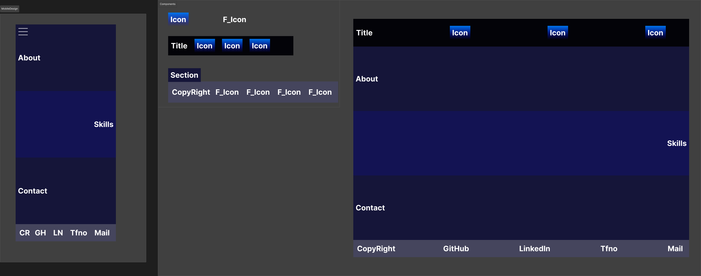
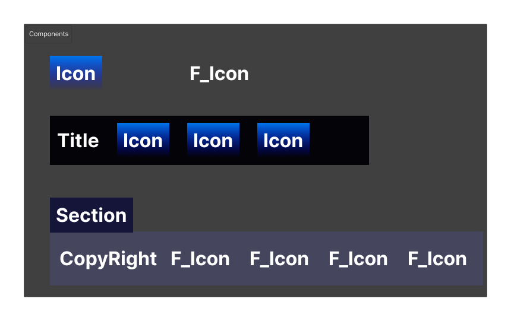
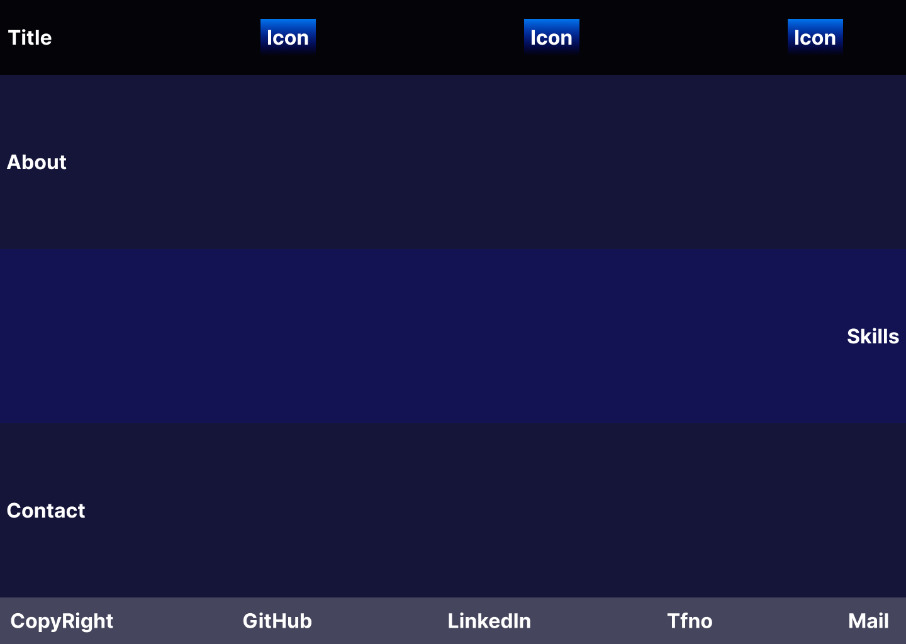
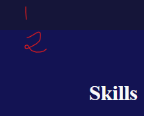

****

# __PORTFOLIO__

****

## GENERAL INFO

Esto es un trabajo en el que hay que diseñar y desarrollar una `web responsive`.

### Requisitos

- [x] Crear un diseño en `Figma`, para ambos dispositivos. [Diseño](https://www.figma.com/file/jBnNXFO3V9TcOKWOdQtf0g/T4.1GraciaLopezJorge?type=design&node-id=0%3A1&mode=design&t=5Tg7YHvvJRpPVQIU-1)

- [x] NavBar en Desktop.

- [x] Menú Hamburguesa en Mobile.

- [x] Uso de imágenes (locales).

- [x] No contener errores de accesibilidad. --> Comprobación mediante [Webaim](https://wave.webaim.org/extension/).

- [x] Usar al menos `3 leyes del UX`.

- [x] Utilizar `import` y `export` de código js.

- [x] Utilizar una función `arrow => {}`.

- [x] Utilizar un `Objeto` de javascript.

- [x] Usar Navigation Links. `<nav>`.

- [x] Seguir la [Guía de estilos js](https://docs.google.com/document/d/1NgBu7h2rhYCxnLye5uPkchNuBdy33NT2HFic-FOTuJM/edit?usp=sharing).

***

## DOCUMENTACIÓN

***

### HTML

> El el head se enlaza el CSS.

Lo primero que vemos es un botón, el `menú hamburguesa`, que solo se mostrará cuando el dispositivo sea móvil.

Luego vemos una `navbar` en la cual se disponen el título y los diferentes enlaces a las secciones. Las secciones están representadas por imágenes.

A continuación se encuentran las propias `secciones`, cada una con su título y contenido. La sección Skills tiene una `tabla` con imágenes.

Por último el `footer`, en el cual se encuentran los derechos de autor y CopyRight, enlaces a GitHub y LinkedId, un botón para contactar por teléfono y un botón que activa directamente el envío de un mail a mi dirección.

> El botón de teléfono no funciona por motivos de privacidad.

### CSS

El CSS lo primero que tiene es el tamaño de activación de los botones. Luego se especifica el comportamiento que se debe seguir a la hora de hacer `scroll` y el color de fondo.

Luego, se le da estilo a la navbar, haciendo que esté `fija` en la pantalla, dándole color de fondo y alinéando los elementos.

A continuación, se hace que todas las secciones ocupen todo el tamaño disponible en pantalla, tomando en cuenta el espacio que cupa la navbar.

A continuación se aplica estilo a los títulos.

En el `footer` se aplica la distribución para sus elementos.

Luego, se aplican estilos a los botones de la navbar, para hacerlos responsivos y que el espacio entre ellos sea el mismo. Además, se les aplica un fondo para cuando el ratón se encuentre encima de cada elemento `hover`, y un color de fondo para aquella sección que esté activa `active`. también se invierte el color de los iconos para que sean visibles en todo momento.

```css
    filter: invert(100%);
```

Lo siguiente que se hace es dar estilo a las secciones, haciendo que las impares tengan un estilo, y las pares otro diferente.

Se da estilo a la tabla, dándole borde y justificación de elementos.

A continuación se hacen unos `media querys` para hacer la web responsive.

Por último, se da estilo a la navbar para dispositivos medianos y se estila también el menú hamburguesa que se muestra en dispositivos pequeños.

### JAVASCRIPT

El javascript maneja el movimiento del gradiente de fondo que se aplica a la sección que esté activa en ese momento.

### FIGMA

En el Figma se pueden observar los diferentes diseños para móvil y desktop.

> Figma completo.



> Componentes.



> Diseño mobile.


> Diseño desktop.



### LEYES UX

Las leyes del UX que se aplican son:

1. Ley de Hick: se añaden pocos elementos para hacer una página más sencilla y agradable a la vista.


2. Ley de Fitts: los elementos de la navbar se encuetran próximos entre sí.


3. Ley de Miller: en ninguna sección, excluyendo la tabla que contiene las imágenes, se muestran más de 7 elementos, haciéndolo fácil de recordar.


4. Ley de Jakob: se emplea un diseó fácil e intuitivo, adaptado para que cualquier usuario con dificultades visuales distinga con facilidad cada elemento.


5. Ley de Región Común: las secciones están claramete separadas según el color de fondo, facilitando así la distinción de cada una.

